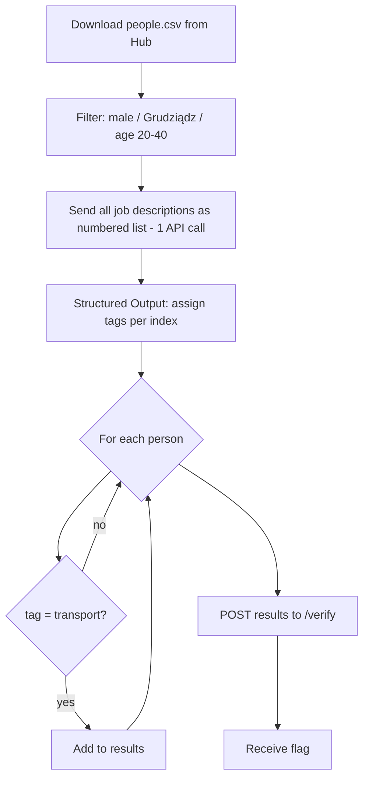

# S01E01 - People

Task from lesson 1. Filters a list of people from the Hub, classifies their jobs using an AI model (Structured Output), and submits matching candidates to the Hub.

## What it does

1. Downloads `people.csv` from the Hub
2. Filters people by: male, born in Grudziądz, age 20-40
3. Sends each person's job description to the AI model for tag classification
4. Keeps only people tagged with `transport`
5. Submits the result to `/verify` and receives a flag

## Flow



## Run

```bash
python main.py
```
