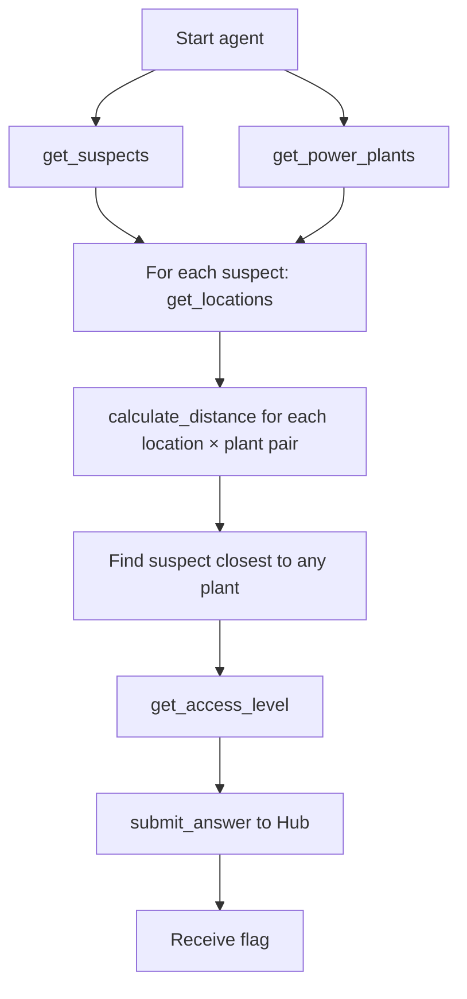

# S01E02 - Find Him

LLM agent identifies which suspect from task s01e01 was spotted near a nuclear power plant, retrieves their access level, and submits the answer to the Hub.

## How it works

1. Agent gets the list of suspects from `s01e01/data/transport_people.json`
2. Agent fetches nuclear power plant locations from the Hub API (`findhim_locations.json`)
3. For each suspect, agent fetches all GPS coordinates where they were spotted (Hub `/api/location`)
4. Agent calculates haversine distance between each suspect location and each power plant
5. Agent identifies the suspect closest to any power plant
6. Agent fetches the suspect's access level (Hub `/api/accesslevel`)
7. Agent submits name, surname, access level, and power plant code to the Hub

## Agent tools

| Tool | Description |
|---|---|
| `get_suspects` | Loads suspect list from s01e01 data |
| `get_power_plants` | Fetches power plant list with GPS coords from Hub |
| `get_locations` | Fetches all spotted locations for a suspect |
| `get_access_level` | Fetches access level for a suspect |
| `calculate_distance` | Haversine distance between two GPS points (km) |
| `submit_answer` | Submits final answer to Hub |

## Flow



## Run

```bash
cd s01e02
python main.py
```
