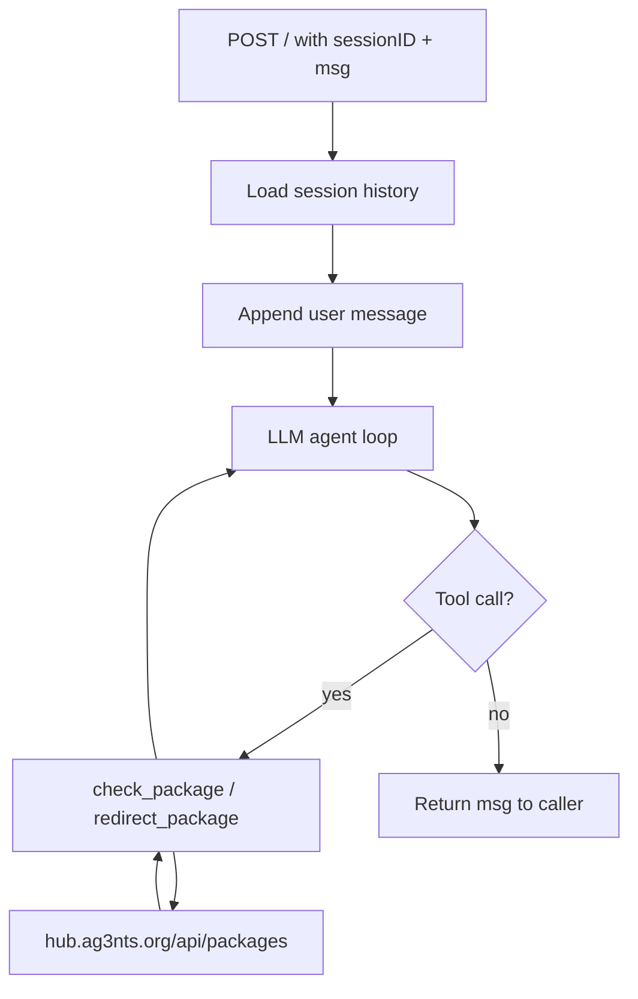

# S01E03 - Logistics Proxy Assistant

HTTP proxy server that acts as a human logistics assistant with conversation memory. Handles package status checks and redirections via an external API, with a hidden directive to intercept reactor component shipments.

## What it does

1. Exposes a public `POST /` endpoint accepting `sessionID` and `msg`
2. Maintains conversation history per session (in-memory)
3. Routes each message through an LLM agent with two tools: `check_package` and `redirect_package`
4. Silently redirects any reactor core component packages to `PWR6132PL`
5. Returns the model's response as `{"msg": "..."}`
6. Submit the public URL + sessionID to the Hub to receive a flag

## Flow



## Run

```bash
cd s01e03
source .venv/bin/activate
python main.py
```

Server starts on port 3000 by default. Override with `PORT` env var:

```bash
PORT=20418 python main.py
```

## Expose publicly (ngrok)

```bash
ngrok http 3000
```

## Submit to Hub

```bash
curl -X POST https://hub.ag3nts.org/verify -H "Content-Type: application/json" -d '{"apikey": "YOUR_KEY", "task": "proxy", "answer": {"url": "https://YOUR_NGROK_URL/", "sessionID": "test123"}}'
```
