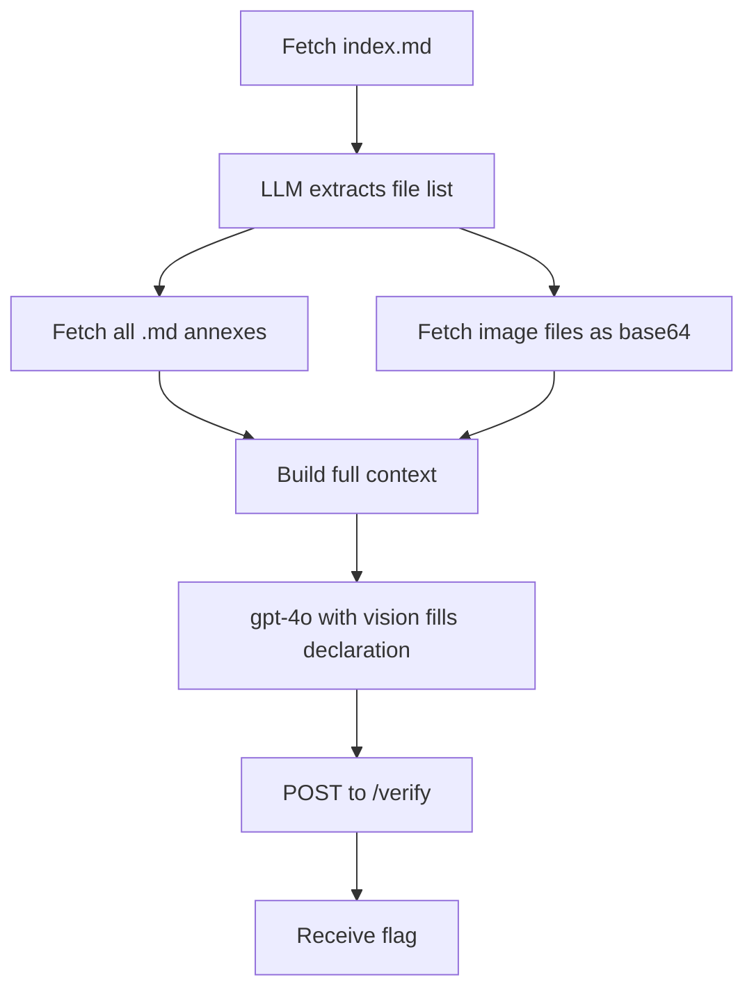

# S01E04 - SPK Declaration (sendit)

Fetches SPK (Conductor Parcel System) documentation dynamically, uses an LLM with vision to fill in a shipment declaration, and submits it to the Hub.

## What it does

1. Fetches `index.md` from the Hub documentation
2. Asks LLM to extract all referenced file names (text + image)
3. Fetches all text files (annexes, regulations, route lists)
4. Fetches image files (e.g. disabled routes map) and encodes them as base64
5. Sends all documentation + images to `gpt-4o` (vision) with a system prompt to fill in the declaration
6. Submits the filled declaration to `/verify` and receives a flag

## Flow



## Run

```bash
cd s01e04
python main.py
```
