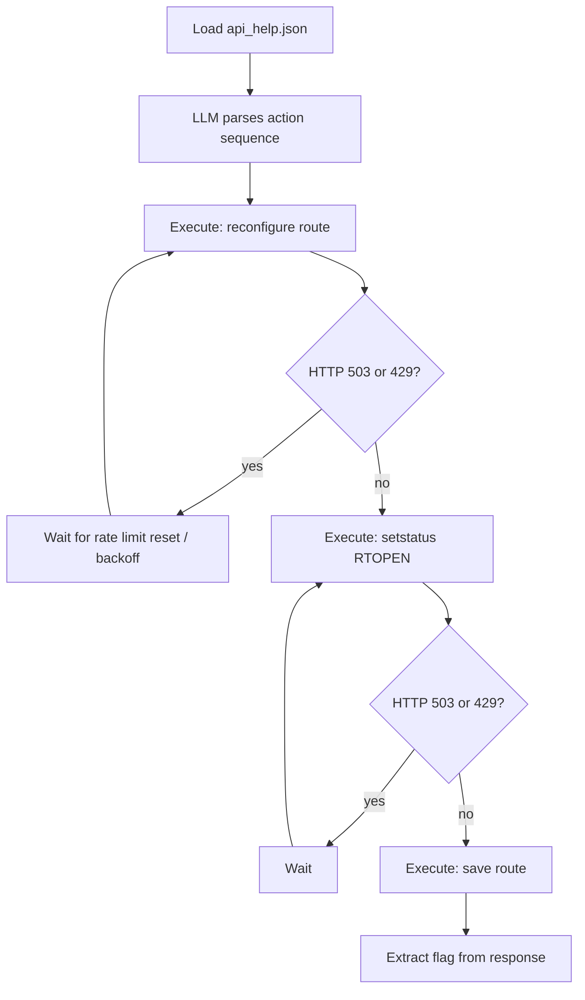

# S01E05 - Railway Route Activation (railway)

Activates a closed railway route via an undocumented, rate-limited API with simulated 503 errors.

## What it does

1. Loads saved API help response (`data/api_help.json`)
2. Uses LLM (`gpt-4o`) to parse the help and determine the correct action sequence
3. Executes the sequence deterministically with retry on 503 and rate limit handling
4. Logs every request/response and respects `X-RateLimit-Reset` headers
5. Extracts the flag from the final response

## Flow



## Run

```bash
cd s01e05
python3 main.py
```
