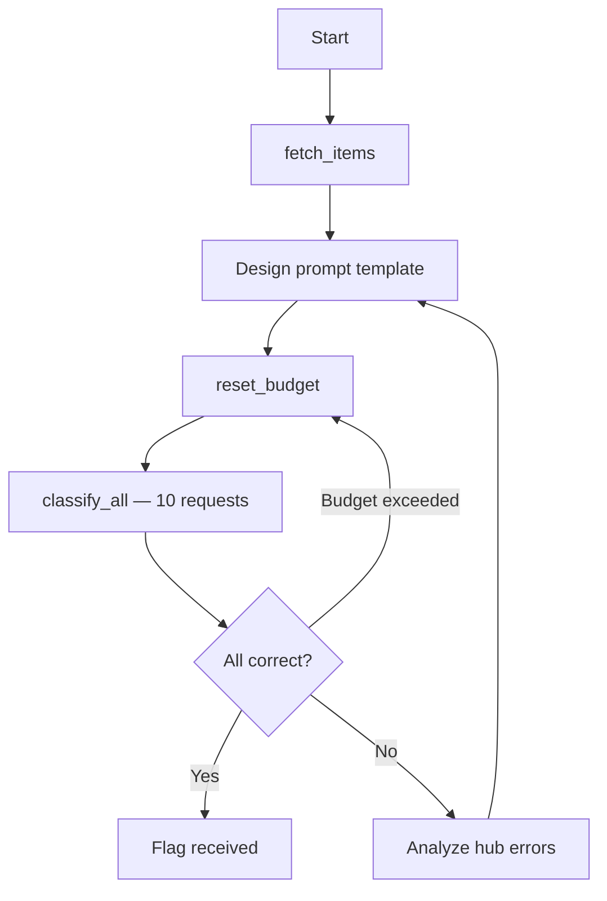

# s02e01 — Cargo Classification via Prompt Engineering

An agent-based prompt engineer that designs and iteratively refines a classification prompt for a constrained LLM classifier (100-token context window). The goal is to classify 10 cargo items as `DNG` (dangerous) or `NEU` (neutral), with a deliberate exception: reactor/nuclear parts must always be classified as `NEU`.

## Steps

1. **Fetch items** — download fresh CSV from hub to inspect the current item list
2. **Design prompt** — craft a concise English template (≤100 tokens) with `{id}` and `{description}` placeholders at the end (static prefix for prompt caching)
3. **Reset budget** — clear the cost counter before each run
4. **Classify all** — substitute real item data into the template, send 10 requests to hub
5. **Iterate** — parse hub error responses, refine the prompt, repeat until `{FLG:...}` is returned

## Flow



## Run

```bash
cd s02e01
python main.py
```
