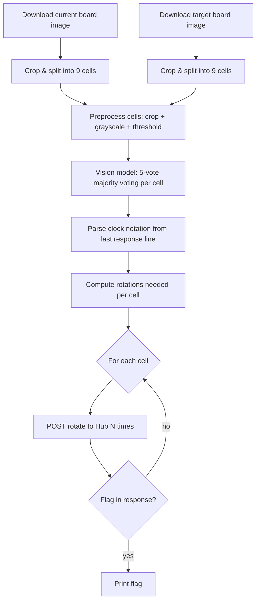

# S02E02 - Electricity Puzzle

Solves a 3x3 electrical grid puzzle by analyzing tile images with a vision model and rotating tiles to match the target configuration.

## What it does

1. Downloads the current puzzle board image from the Hub
2. Downloads the target (solved) board image
3. Crops each image to the 3x3 grid and splits into 9 individual cell images
4. Preprocesses each cell: 5px inner crop, grayscale, binary threshold
5. Sends each cell to a vision model 5 times with varied prompts (majority voting)
6. Model reasons step by step which edges the thick black line touches, returns clock notation (12=top, 3=right, 6=bottom, 9=left)
7. Computes how many 90° CW rotations are needed per cell to match the target
8. Sends rotation commands to the Hub until the flag appears

## Flow



## Run

```bash
python main.py
```

Dry run (no rotations sent):

```bash
python main.py --dry-run
```
