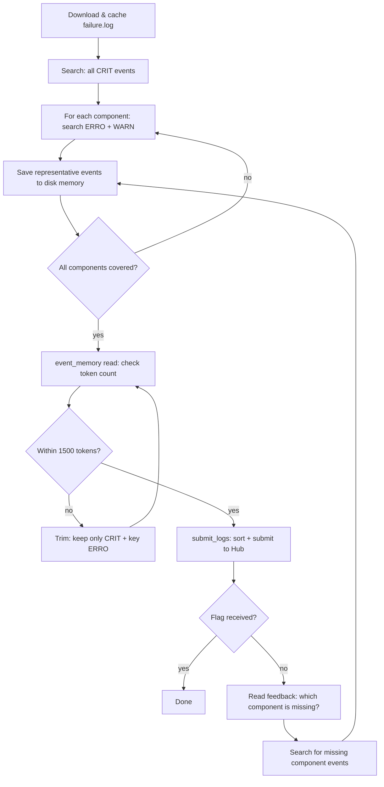

# S02E03 - Log Compression

Agent that downloads a large power plant failure log, compresses it to a 1500-token condensed summary using on-disk memory to keep context small, and iterates based on technician feedback until receiving a flag.

## What it does

1. Downloads `failure.log` from the Hub and caches it locally in `data/`
2. Searches for CRIT events to identify all component IDs involved in the failure
3. For each component, searches its ERRO and WARN events and saves key entries to disk via `EventMemoryTool`
4. Submits collected events to Hub — events are sorted chronologically and token-checked automatically
5. Reads technician feedback and adds missing component events to memory
6. Repeats until flag is received

## Flow



## Run

```bash
cd s02e03
python main.py                      # 20 iterations (default)
python main.py --max-iterations 30  # increase if needed
```
