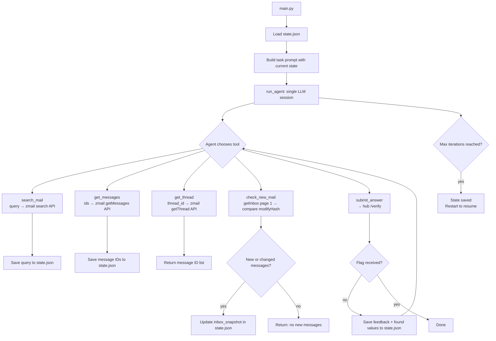

# S02E04 - Mailbox Investigation Agent

Agent that searches a live mailbox via API to extract three hidden pieces of information: a planned attack date, an employee password, and a security ticket confirmation code. Progress is persisted to disk so the agent can resume exactly where it left off if it hits the iteration limit.

## What it does

1. Loads `data/state.json` on startup — if it exists, the agent resumes with already-found values, already-searched queries and already-processed message IDs pre-loaded into its task prompt.
2. Calls `search_mail` with Gmail-style operators to proactively hunt for target values (e.g. `from:proton.me`, `SEC-`, `subject:hasło`).
3. Calls `get_messages` with the IDs returned by search to read the full message body — never draws conclusions from subject lines alone.
4. Calls `get_thread` when a message belongs to a longer conversation to retrieve all related message IDs.
5. After processing all available messages, calls `check_new_mail` to poll `getInbox` and detect messages that have arrived or changed since the last check (tracked via `modifyHash` in `state.json`).
6. Submits partial or complete answers via `submit_answer`. The hub responds with feedback indicating which fields are still missing or incorrect — this feedback is saved to `state.json`.
7. Repeats until the hub returns a flag.

## Architecture

```
main.py
  └─► agent.run()
        └─► run_agent() — one continuous LLM session (max 100 iterations)
              │
              ├─ search_mail(query)        ─┐
              │    └─► saves query         │
              │        to searched_queries  │  all zmail calls go through
              ├─ get_messages(ids)         │  zmail_client.call(action, **kwargs)
              │    └─► saves IDs           │  → POST /api/zmail
              │        to processed_ids    │
              ├─ get_thread(thread_id)     │
              │                           ─┘
              ├─ check_new_mail()
              │    └─► getInbox page 1 → compare modifyHash with inbox_snapshot
              │    └─► returns only new or changed messages
              │    └─► updates inbox_snapshot in state.json
              │
              └─ submit_answer(date, password, confirmation_code)
                   └─► POST /verify
                   └─► saves found values + hub feedback to state.json
```

## State persistence

All progress is stored in `data/state.json` (gitignored):

```json
{
  "found": {
    "date": "2026-03-23",
    "password": null,
    "confirmation_code": null
  },
  "missing": ["password", "confirmation_code"],
  "last_feedback": "password value is incorrect",
  "searched_queries": ["from:proton.me", "SEC-"],
  "processed_message_ids": ["92", "1"],
  "inbox_snapshot": {
    "92": "6624add090a5cb06f5c192653b5a243c",
    "1":  "336e86c17f393ddc53180aa07399d7f0"
  }
}
```

`inbox_snapshot` maps `rowID → modifyHash`. `check_new_mail` uses it to detect:
- **new messages** — rowID not yet in snapshot
- **updated messages** — rowID present but modifyHash changed (e.g. a new reply arrived in the thread)

If the agent hits `max_iterations`, state is fully preserved. The next run rebuilds the task prompt from `state.json` so the agent skips what it already knows and continues from where it stopped.

## Flow



## Run

```bash
# From project root
python -m s02e04.main
```

To resume after hitting max_iterations, simply run again — `state.json` preserves all progress.

To start fresh, delete `data/state.json` before running.
