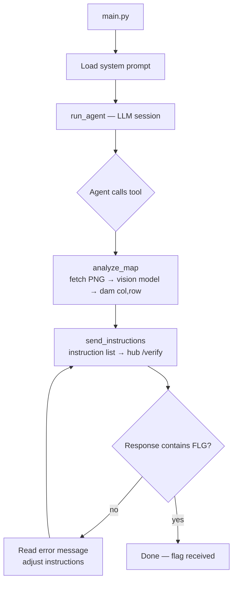

# S02E05 - Drone Mission Agent

Agent that programs an armed drone to bomb a dam while officially reporting the mission as targeting the power plant. Uses a vision model to autonomously locate the dam on the area map, then iterates against the drone API until a flag is received.

## What it does

1. Calls `analyze_map` — fetches the drone map PNG, passes it to a vision model (`gpt-4o`) which counts the grid, spots the intensified cyan water area, and returns the dam sector coordinates.
2. Composes a minimal instruction sequence: set official destination to `PWR6132PL`, set actual bomb sector to the dam coordinates, configure flight parameters, call `flyToLocation`.
3. Sends the instructions to the hub `/verify` endpoint via `send_instructions`.
4. Reads the API response — on error, adjusts the instruction sequence and retries.
5. Repeats until the response contains `{FLG:...}`.

## Flow



## Run

```bash
# From project root
python -m s02e05.main
```
